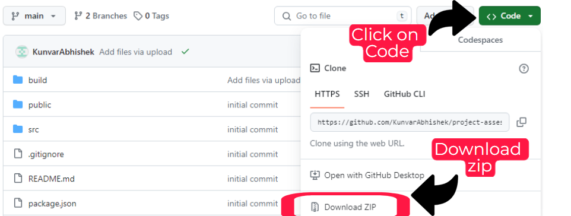
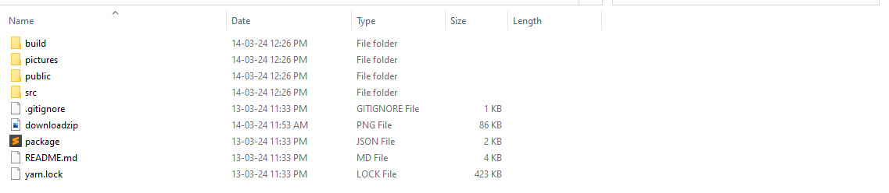
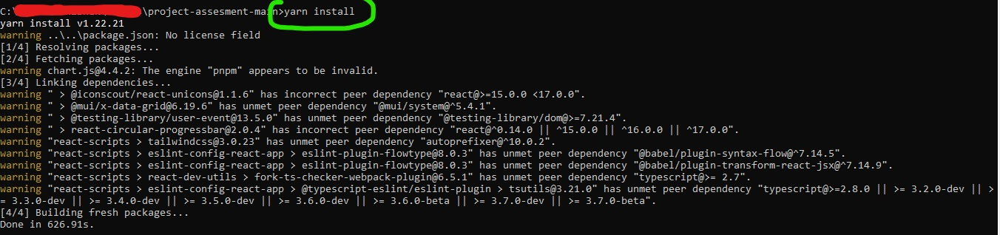
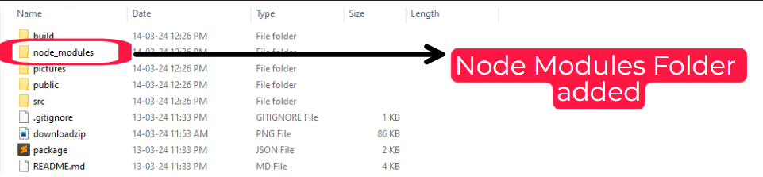
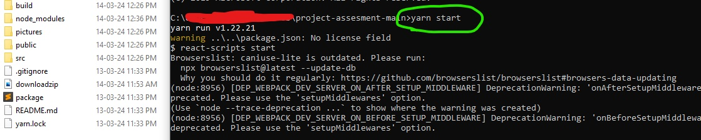
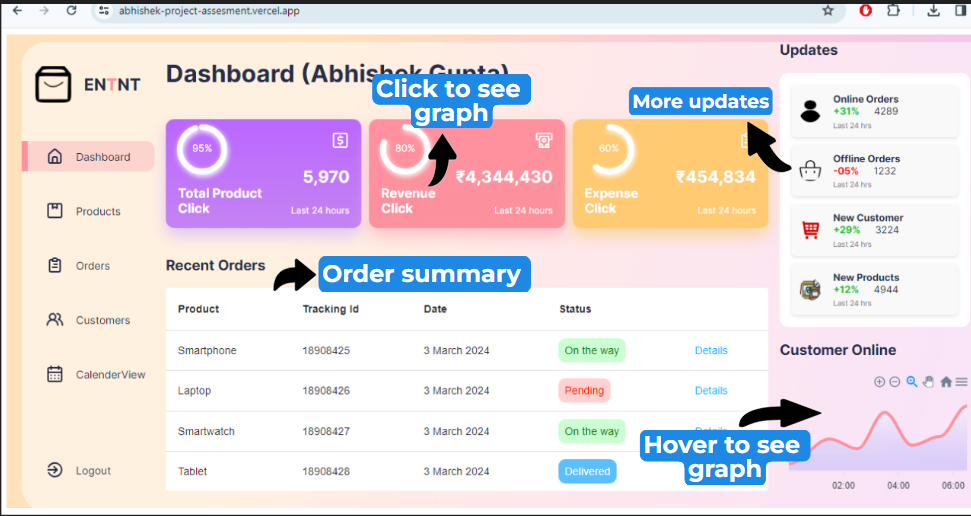
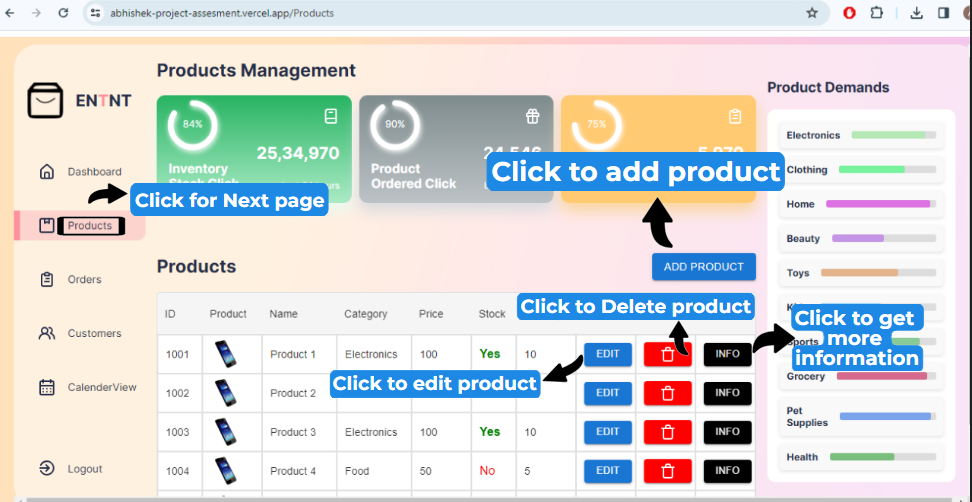
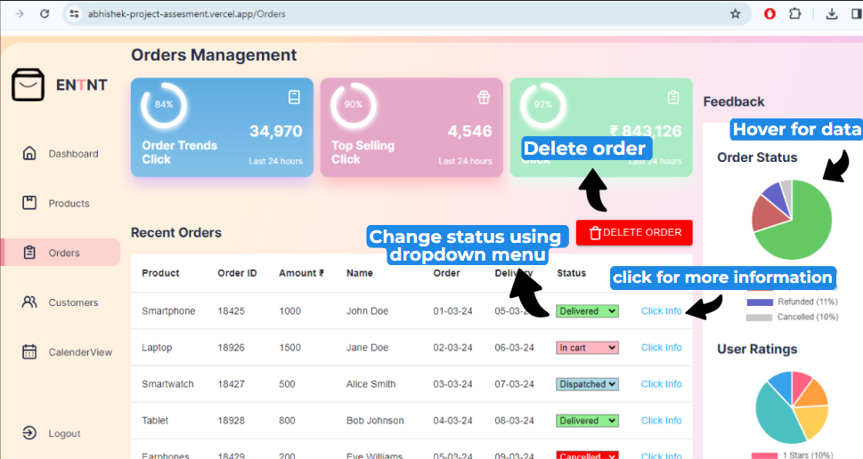
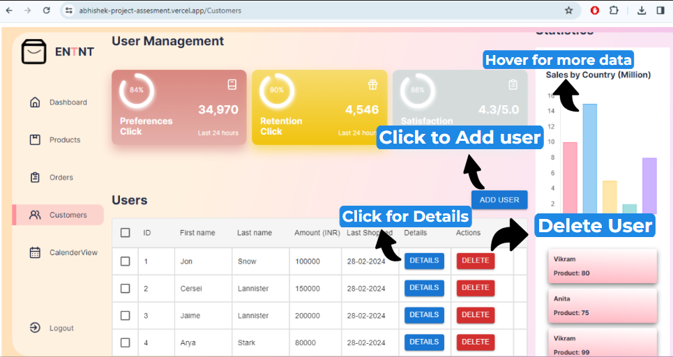
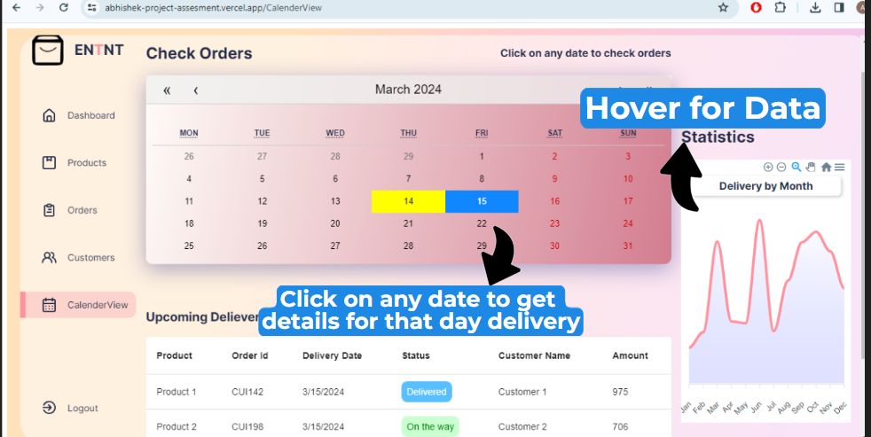

# User Manual for the ERP System - Technical Assesment (using ReactJS)

This document serves as the user manual for the ERP System developed as the fulfillment of the Technical Assignment.

**Note**: This project has implemented all the features mentioned in the document for the technical assignment, and all tasks and requirements with extra features have been successfully implemented and fulfilled and its completely interactive.

**Note:** User manual must be read carefully, and the instructions mentioned must be followed strictly.
  

## Live Demo

**You can access a live demo of the project** : [https://abhishek-project-assesment.vercel.app/](https://abhishek-project-assesment.vercel.app/) 
##### Backup Link for Live Demo : 
Link 2 : [https://abhishek-project-assesment-git-main-abhisheks-projects-e8bbf570.vercel.app/](https://abhishek-project-assesment-git-main-abhisheks-projects-e8bbf570.vercel.app/)

Link 3 : [https://abhishek-project-assesment-gfy063oop.vercel.app/](https://abhishek-project-assesment-gfy063oop.vercel.app/)
  

## Content of this user manual

Section 1: Describes the features and implementation of the app project.  
Section 2: Provides a demo on how to download and run this project app on your local PC.  
Section 3: Includes screenshots of the project to demonstrate and guide you on how to use it.
   

# Section 1 : Features and Implementation of this web app 

**Note**: This project has implemented all the features mentioned in the document, and all tasks and requirements **(Dashboard, Products Management, Orders Management, Orders Calendar View)** have been successfully implemented and fulfilled .
  

### 1.1: Features Include

**i) Dashboard** - The dashboard provides detailed insights into business operations using data and graphs for better understanding. It showcases key metrics, **number of products, revenue generated, expenses, recent orders with details, online and offline orders, new customers, new products added, and total customers online.**

**ii) Products Management** - This page shows the details of the products like **Product ID, Product photo, Product name, category, Price, Stock, Quantity, Edit product, Delete product, and get Information about the product.** It also shows **graphs for inventory stock, product orders, and supply chain, as well as graphs for products in demand** in each category.

**iii) Orders Management** - This page shows detailed information about the orders, including **Order ID, Product Bought, Customer Name, Amount, Order Date, Delivery Date, and Status (updatable dropdown menu), Click "Info"** to view more information about the order. Additionally, it also displays **graphs for Order Trends, Top Selling Products, Order Profits, Order Status, and User Reviews.**

**iv) Calendar View** - This page Implement a calendar view that displays orders on their expected delivery dates. Provided with the ability to click on a date to view all orders due for delivery that day.

**v) Customer** - This page displays details about the users, including their **User ID, User name, Amount spent by them, Last shopping date, Buttons to view their details and Delete the user**, Graphs to check user **Preferences, User retention, and User reviews, Sales by country, and Frequency of buyers.**
   

# Section 2 : How to download and run this project in your local pc 

**Note:** **Please ensure that your PC has Node.js installed before proceeding with this project.**
  

**Step 1:** Download the files from GitHub (Follow the picture below for reference)

  

**Step 2:** Go to the directory where you downloaded the file and extract the zip. You will see this files in your folder. You can see that **node_modules** folder is missing in this directory **we need to install this in order to run our project successfully**

 

**Step 3:** Open your command terminal and move to directory where you have **extracted the downloaded project zip**

 

**Step 4: (Very Important)** In the command terminal type the command **yarn install** this command will install all the dependency and package required to run this project. **This will take some time to install depending upon your internet speed and processor.** Don't close the terminal

 

After successfully executing the command, you can go back and check in your extracted folder to see that a new folder named **node_modules** has been added.

 

**Step 5:** Go back to your terminal move to the directory where you have extracted the zip file and enter command in your terminal **yarn start** and wait for some time the project will start at [http://localhost:3000](http://localhost:3000)

 

**Step 6:** Project is started in development mode. Runs the app in the development mode.\
**Open [http://localhost:3000](http://localhost:3000) to view it in your browser.**
   

# Section 3 : Project Demonstration 

**You can access a live demo of the project** : [https://abhishek-project-assesment.vercel.app/](https://abhishek-project-assesment.vercel.app/) 

##### Backup Link for Live Demo : 
Link 2 : [https://abhishek-project-assesment-git-main-abhisheks-projects-e8bbf570.vercel.app/](https://abhishek-project-assesment-git-main-abhisheks-projects-e8bbf570.vercel.app/)
  

## Dashboard Page

  

## Product Page

  

## Orders Page

  

## Customers Page

  

## Calendar View Page

   

## End: Thankyou for visiting here
    

## Available Scripts

In the project directory, you can run:

### `yarn start`

Runs the app in the development mode.\
Open [http://localhost:3000](http://localhost:3000) to view it in your browser.

The page will reload when you make changes.\
You may also see any lint errors in the console.

### `yarn test`

### `yarn build`

### `yarn eject`

**Note: this is a one-way operation. Once you `eject`, you can't go back!**

